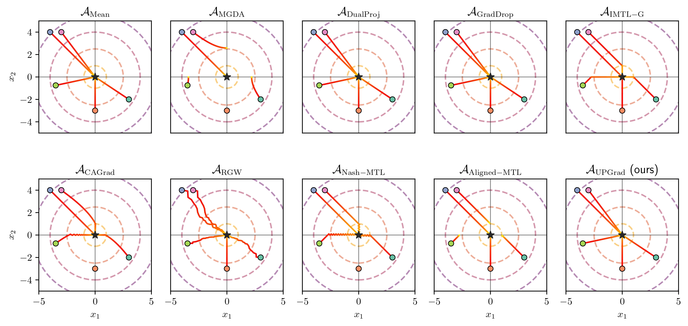
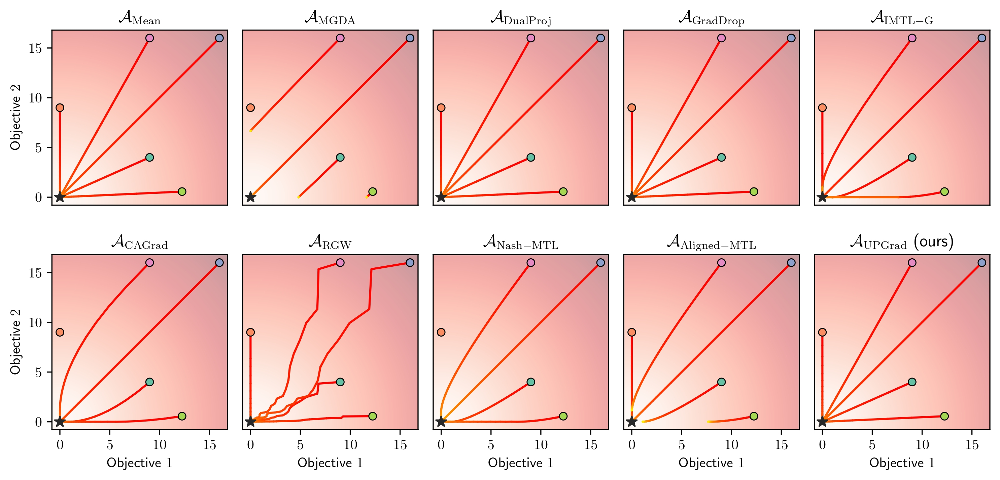
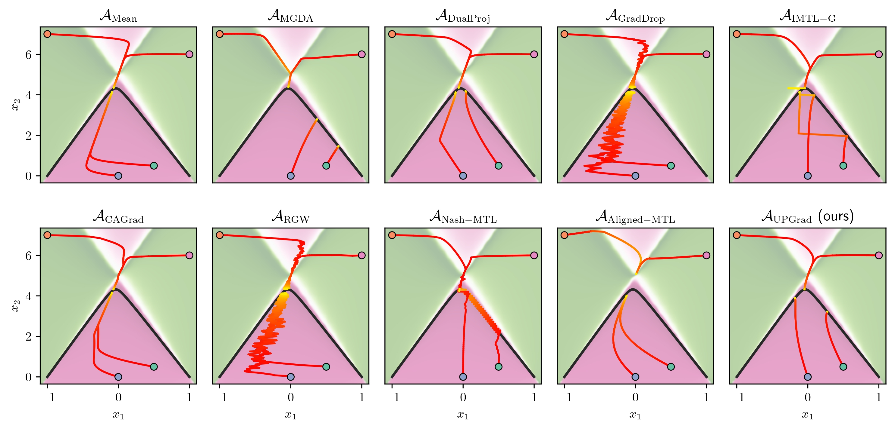
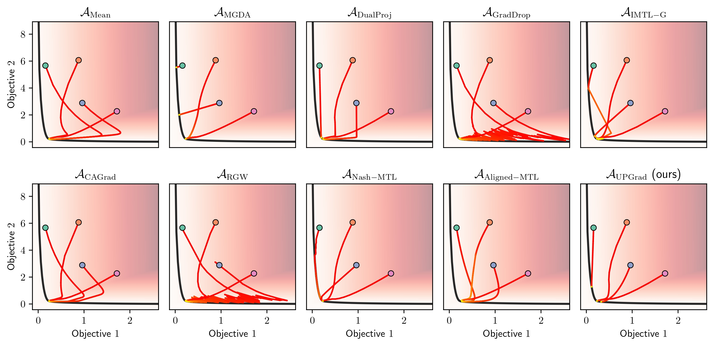

# trajectories

This repo uses Jacobian descent to optimize simple multidimensional functions and plots the obtained
optimization trajectories.

## Installation
```bash
uv python install 3.13.3
uv python pin 3.13.3
```

```bash
./setup_env.sh main
```
Note that here, "main" can be replaced with whatever ref (branch, tag or commit hash) of torchjd you
want.

Alternatively, you may want to install using the `uv.lock` file to reproduce an exact environment.

You might also need some tex packages to be able to generate the plots (see
https://stackoverflow.com/a/53080504)

```bash
sudo apt-get install texlive-latex-extra texlive-fonts-recommended dvipng cm-super
```

## Usage
Please refer to the docstring of the scripts.

## Examples

### Element-wise quadratic

Optimization of the function f(x₁, x₂) = [x₁², x₂²]ᵀ by various aggregators.

Trajectories in the parameter space:


Trajectories in the value space:


### Convex quadratic form

Optimization of the function described in Eq. 14 of https://arxiv.org/pdf/2406.16232v3

Trajectories in the parameter space:


Trajectories in the value space:

